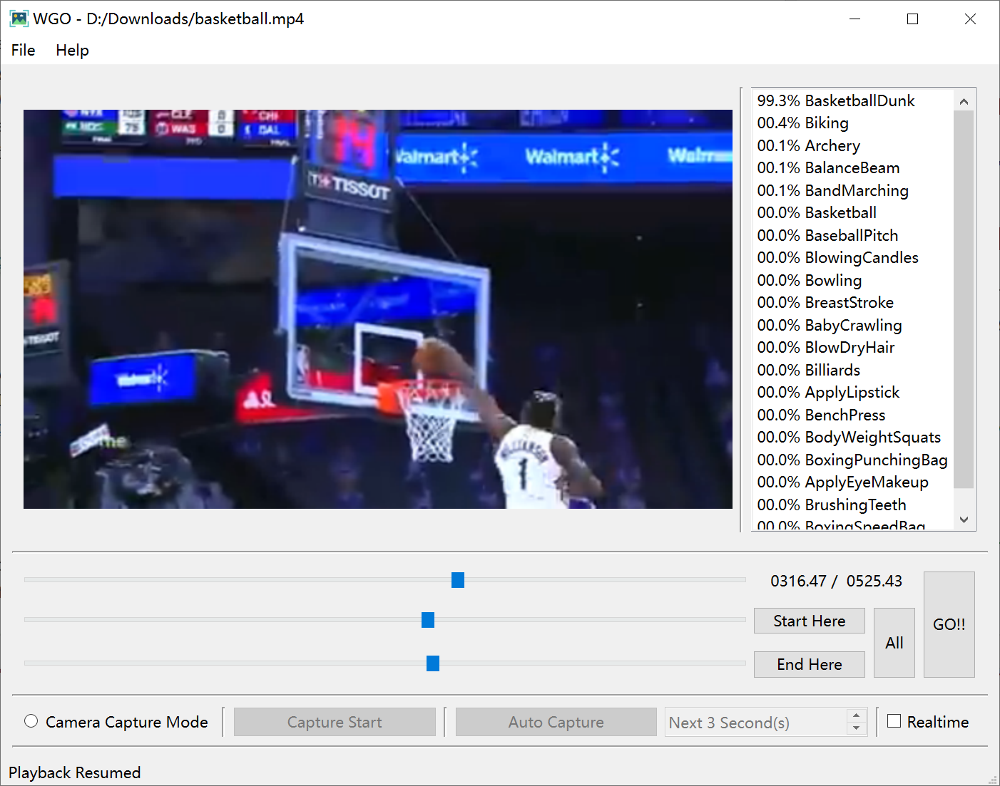

WGO
==========
WGO (What's Going On), an Action Recognition tool.

Features
-----

1. Action Recognition of course, but it needs your own implementation of [`WGOInterface`](wgo_interface.py).
2. Load video files, select a segment of it to do recognition.
3. Open camera to capture video stream.

Screenshot(s)
-----
Shot with modified C3D model. *Ignore that Realtime checkbox, not implemented yet.*

Requirements
-----
~~Good graphic card I guess.~~  
Not yet.